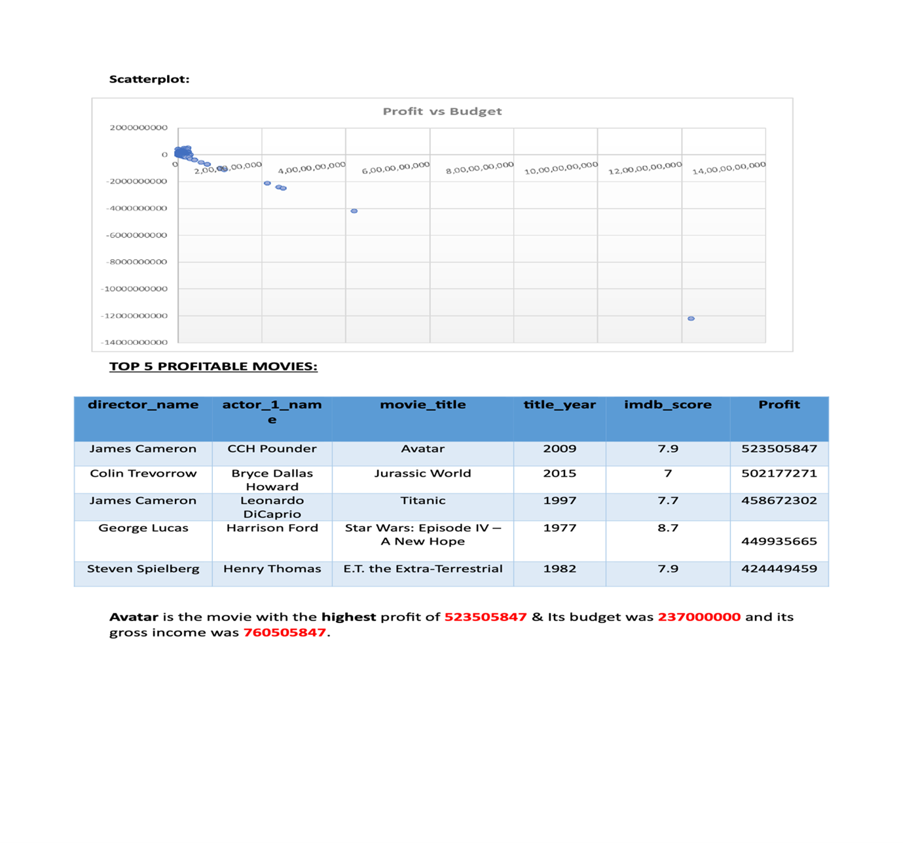
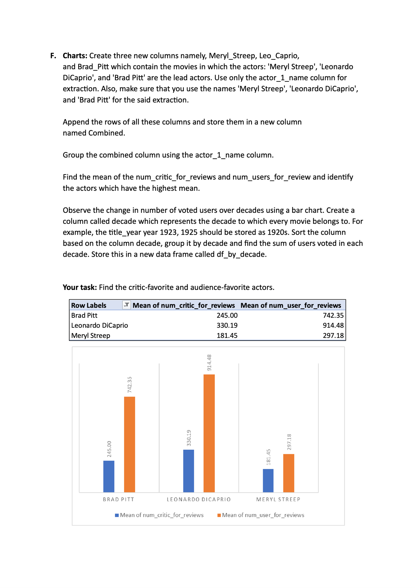

# IMDB Movie Analysis Project

## Overview
The IMDB Movie Analysis project delves into the depths of the film industry, leveraging data from the renowned Internet Movie Database (IMDB). By meticulously cleaning, analyzing, and visualizing the dataset, this project aims to unearth valuable insights into box office performance, audience preferences, critical reception, and the influence of actors and directors.

## Tech-Stack Used
- **Analysis**: Microsoft Excel
- **Report Creation**: Microsoft Word
- **Data Repository**: Google Sheets

## Insights Obtained

### 1. Data Cleaning
Through rigorous data cleaning processes, including the removal of blank rows, null values, and irrelevant columns, the dataset was refined to 3757 rows and 24 columns.

### 2. Movies with Highest Profit
Utilizing the 'profit' column derived from the difference between gross and budget, the top 5 most profitable movies were identified, with "Avatar" leading the pack with a staggering profit of $523,505,847.

### 3. Top 250 IMDb Rated Movies
A curated list of the top 250 IMDb rated movies, each with over 25,000 votes, was created. Foreign language films within this list were also identified.

### 4. Best Directors
The top 10 directors, ranked by the mean IMDb score of their films, were determined. In cases of tied scores, alphabetical sorting was applied.

### 5. Popular Genres
By analyzing genre frequencies, it was concluded that Comedy, Drama, and Romance are the most popular genres among audiences.

### 6. Critic and Audience Favorite Actors
Lead actors Meryl Streep, Leonardo DiCaprio, and Brad Pitt were evaluated based on the mean of critic and user reviews, with Leonardo DiCaprio emerging as the favorite.

### 7. User Voting Trends
Decadal analysis of user votes revealed an exponential increase over the years, reflecting the growth and globalization of the film industry.

## Project Outcome
The IMDB Movie Analysis project not only offers a comprehensive understanding of the film industry but also provides actionable insights for stakeholders, including producers, distributors, studios, and enthusiasts. By harnessing the power of data analytics and visualization tools, this project serves as a valuable resource for decision-making and research within the realm of cinema.

## Key Takeaways
1. **Data-driven Decision Making**: Empower stakeholders with actionable insights derived from comprehensive data analysis.
2. **Trends Identification**: Uncover emerging trends and patterns within the film industry to stay ahead of the curve.
3. **Audience Engagement**: Understand audience preferences and sentiments to tailor content and marketing strategies.
4. **Industry Benchmarking**: Benchmark against industry standards and competitor performances to drive continuous improvement.

